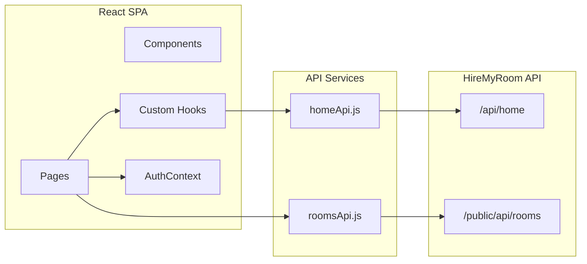

# HireMyRoom

**Find rooms. Book instantly. Move in.**

HireMyRoom is a modern room rental marketplace frontend built with React and Tailwind CSS. Browse verified listings, filter by location and category, and explore role-based dashboards for property owners and guests.

---

## Table of Contents

- [Features](#features)
- [Tech Stack](#tech-stack)
- [Architecture](#architecture)
- [Getting Started](#getting-started)
- [Project Structure](#project-structure)
- [API Integration](#api-integration)
- [Authentication](#authentication)
- [Routing](#routing)
- [Available Scripts](#available-scripts)
- [Docker](#docker)
- [Deployment](#deployment)
- [Roadmap](#roadmap)

---

## Features

### Public experience

- **Homepage** with featured sections: Super Hot, Hot, Newly Added, and Apartments / Villas / Farmhouses
- **Room catalog** with pagination, search, and filters (type, city, area, price sort)
- **Room details** with image galleries and booking entry points
- **Category browsing** — Normal, Luxury, VIP, VVIP, and Couples rooms
- **Scroll-reveal animations** with reduced-motion support
- **Fully responsive** layout for mobile, tablet, and desktop

### Owner dashboard

- Dashboard overview with stats and quick actions
- Add and manage property listings
- Upload property photos (drag-and-drop UI)
- Review and respond to reservation requests
- Profile management

### Guest dashboard

- Track booking requests (Pending / Accepted / Rejected)
- View confirmed bookings
- Submit booking requests from listing pages
- Profile management

---

## Tech Stack

| Layer | Technology |
|-------|------------|
| UI | React 19, Tailwind CSS 4 |
| Build | Vite 7 |
| Routing | React Router DOM 7 |
| Icons | Lucide React |
| State | React Context API |
| Linting | ESLint 9 |

---

## Architecture



**Data flow:** Public pages fetch live listing data from the HireMyRoom test API. Authentication and dashboard actions currently use mock data stored in `localStorage`, ready for backend wiring.

---

## Getting Started

### Prerequisites

- **Node.js** 18 or later
- **npm** 9+ (or a compatible package manager)

### Installation

```bash
# Clone the repository
git clone https://github.com/<your-org>/HireMyRoom.git
cd HireMyRoom

# Install dependencies
npm install

# Start the development server
npm run dev
```

Open [http://localhost:5173](http://localhost:5173) in your browser.

### Production build

```bash
npm run build    # Output to dist/
npm run preview  # Preview the production build locally
```

### Try the dashboards (mock auth)

1. Go to `/login`
2. Choose **Owner** or **Guest**
3. Enter any email and password
4. You will be redirected to the matching dashboard

| Role | Redirect |
|------|----------|
| Owner | `/owner/dashboard` |
| Guest | `/guest/booking-requests` |

---

## Project Structure

```
HireMyRoom/
├── src/
│   ├── components/
│   │   ├── cards/          # RoomCard, CategoryCard, skeletons
│   │   ├── common/         # SearchBar, Button, Loader, modals, ScrollReveal
│   │   └── layout/         # Navbar, Footer, OwnerLayout, GuestLayout
│   ├── context/
│   │   └── AuthContext.jsx # Session state (mock auth)
│   ├── data/
│   │   └── dummyRooms.js   # Fallback data for demo room IDs
│   ├── hooks/
│   │   ├── useHomeData.js  # Home page data fetching
│   │   └── useScrollReveal.js
│   ├── pages/
│   │   ├── Home.jsx
│   │   ├── Rooms.jsx
│   │   ├── RoomDetails.jsx
│   │   ├── Login.jsx
│   │   ├── Signup.jsx
│   │   ├── AboutUs.jsx
│   │   ├── owner/          # Owner dashboard pages
│   │   └── guest/          # Guest dashboard pages
│   ├── routes/
│   │   └── AppRoutes.jsx   # Public + protected routes
│   ├── services/
│   │   ├── homeApi.js      # Home endpoint + image URL helpers
│   │   └── roomsApi.js     # Rooms listing + detail endpoints
│   ├── App.jsx
│   ├── main.jsx
│   └── index.css
├── public/
├── Dockerfile
├── vite.config.js
├── eslint.config.js
└── package.json
```

---

## API Integration

Listing data is fetched from the HireMyRoom test environment:

| Service | Endpoint | Purpose |
|---------|----------|---------|
| Home | `https://test.hiremyroom.com/api/home` | Featured room sections, cities, areas |
| Rooms | `https://test.hiremyroom.com/public/api/rooms` | Paginated room catalog |
| Room detail | `.../public/api/rooms/:id` | Single listing |
| Images | `https://test.hiremyroom.com/images/{size}_{filename}` | Room photos (`small`, `medium`, `large`) |

Service modules live in `src/services/`. Image URL helpers are exported from `homeApi.js` via `getRoomImageUrl()` and `resolveRoomImage()`.

---

## Authentication

Authentication is **mocked for development**:

- Login accepts any credentials and assigns a role (`OWNER` or `GUEST`)
- Session persists in `localStorage` under the `user` key
- Protected routes redirect unauthenticated users to `/login`
- Wrong-role access redirects to the correct dashboard

Production auth (JWT, OAuth, etc.) is planned as a future integration.

---

## Routing

### Public

| Path | Page |
|------|------|
| `/` | Home |
| `/rooms` | All rooms |
| `/rooms/:id` | Room details |
| `/login` | Login |
| `/signup` | Sign up |
| `/aboutus` | About |

### Owner (requires `OWNER` role)

| Path | Page |
|------|------|
| `/owner/dashboard` | Overview |
| `/owner/add-property` | New listing |
| `/owner/manage-properties` | Property table |
| `/owner/upload-photos` | Photo upload |
| `/owner/reservations` | Booking management |
| `/owner/profile` | Profile settings |

### Guest (requires `GUEST` role)

| Path | Page |
|------|------|
| `/guest/booking-requests` | Sent requests |
| `/guest/bookings` | Confirmed bookings |
| `/guest/profile` | Profile settings |

---

## Available Scripts

| Command | Description |
|---------|-------------|
| `npm run dev` | Start Vite dev server with HMR |
| `npm run build` | Build optimized production bundle |
| `npm run preview` | Serve the production build locally |
| `npm run lint` | Run ESLint |

---

## Docker

A Dockerfile is included for containerized development:

```bash
docker build -t hiremyroom .
docker run -p 5173:5173 hiremyroom
```

The container runs `npm run dev -- --host` on port **5173**. For production, build static assets with `npm run build` and serve the `dist/` folder with your preferred static host or reverse proxy.

---

## Deployment

**Recommended:** Deploy the Vite build output (`dist/`) to a static host such as Vercel, Netlify, or Cloudflare Pages.

1. Run `npm run build`
2. Publish the `dist/` directory
3. Configure SPA fallback so all routes serve `index.html`

Ensure the deployment environment can reach `test.hiremyroom.com` (or update API base URLs in `src/services/` when pointing to production).

---

## Roadmap

- [ ] Real authentication API (JWT / session tokens)
- [ ] Owner and guest CRUD wired to backend
- [ ] Payment integration for bookings
- [ ] Reviews and ratings
- [ ] Map-based location search
- [ ] Email and push notifications
- [ ] Environment-based API configuration (`VITE_API_BASE_URL`)

---

## License

No license file is included yet. Add one before open-sourcing or distributing this project.

---

<p align="center">
  Built with React & Vite
</p>
